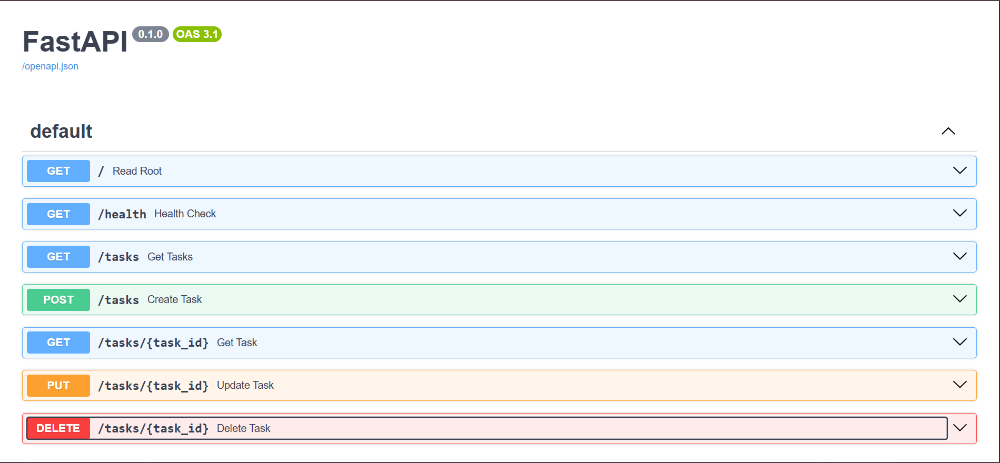

## Example Request
\`\`\`bash
curl -i http://localhost:8000/tasks/1

HTTP/1.1 200 OK
date: Tue, 14 Jul 2026 14:00:00 GMT
server: uvicorn
content-length: 44
content-type: application/json

{"id":1,"title":"Set up server","done":true}
\`\`\`

## Swagger UI Documentation
