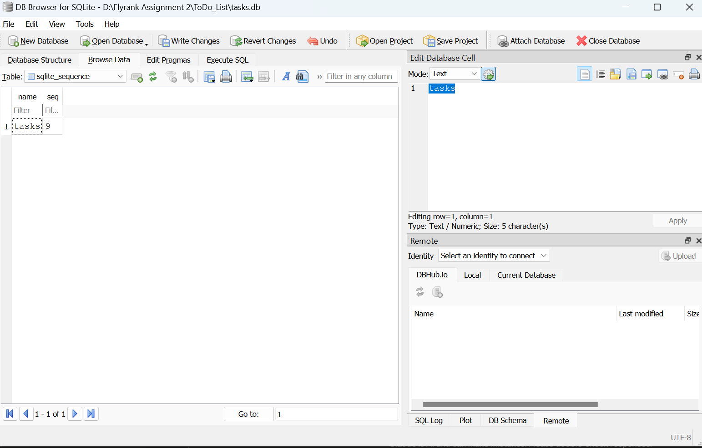
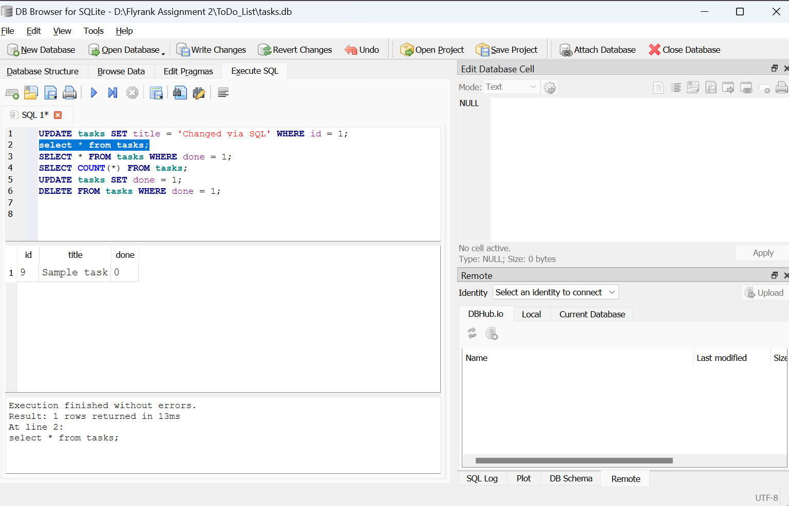

# Task API

A simple in-memory CRUD API for managing a to-do list, built with FastAPI and Python.

## How to run
Make sure you have FastAPI and Uvicorn installed. Start the server locally using:
`uvicorn main:app --reload`

## Endpoints

| CRUD operation | HTTP method | Example endpoint | Meaning |
|---|---|---|---|
| Create | POST | `POST /tasks` | Add a new task |
| Read | GET | `GET /tasks` <br> `GET /tasks/3` | List all tasks / get task 3 |
| Update | PUT | `PUT /tasks/3` | Change task 3 |
| Delete | DELETE | `DELETE /tasks/3` | Remove task 3 |

## Example Request

```bash
curl -i http://localhost:8000/tasks/1
```

```
HTTP/1.1 200 OK
date: Tue, 14 Jul 2026 14:00:00 GMT
server: uvicorn
content-length: 44
content-type: application/json

{"id":1,"title":"Set up server","done":true}
```

## Swagger UI Documentation


## Database

- **Why SQLite**: lightweight, file-based, requires no separate database server — a good fit for a small CRUD assignment.
- **Database file**: `tasks.db`, created automatically in the project root the first time the app runs.
- **How to start**: `uvicorn main:app --reload --port 5000` — the database and `tasks` table are created automatically on startup, and three example tasks are seeded only if the table is empty.
- **Example SQL query I ran**: `SELECT * FROM tasks WHERE done = 1;`

### Screenshots

Database structure (Browse Data tab):



Manual SQL queries executed (Execute SQL tab):


